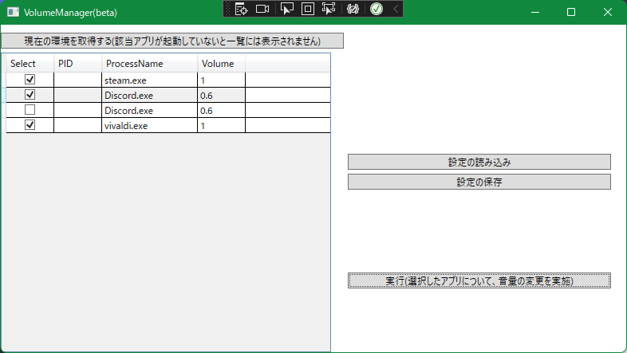

# Volume Managerの使い方

## 起動方法
フォルダ内にあるVolumeManager.exeを起動します。
名前の付け方が悪く紛らわしくて申し訳ありませんが、Volume_Manager.exeはVolumeManager.exeから呼び出されるサブルーチンですので起動しても黒い画面が表示されるだけで何も起きません。

## 機能
### 現在の環境を取得
現在起動しているアプリケーションについて、音量ミキサーに登録されているものについて、
「現在の環境を取得する」ボタンを押下することで一覧に表示されます。

※この画面上ではボリュームの変更はできませんので、事前に音量に設定してからボタンを押下してください。

### 設定の保存
「設定の保存」ボタンを押下することで、一覧に表示されているアプリケーションの音量設定を
保存します。
保存時に必要ないアプリケーションについてはチェックボックスを外すことで、保存の対象外に設定できます。

### 設定の読み込み
「設定の読み込み」ボタンを押下することで、過去に保存した設定を呼び出すことができます。

※1 PIDは保存されていないので、読み込んだ後ブランクになります。
※2 設定を読み込んでいるだけで、音量はまだ変更されていません。

### 実行
「実行」ボタンを押下することで一覧に表示されている内容で、音量を一括変更します。
変更したくないアプリケーションについてはチェックボックスを外すことで、実行の対象外に設定できます。

※ アプリケーション名で音量を変更するため、Discordのようなチャットボイスと通知音で2種類の出力があるアプリケーションについては個別に音量を指定することができません。

## 免責事項
これに同梱されたプログラムその他が原因で発生したいかなる損害も当方は一切関知しません。
また、全てのプログラムがウイルスではないという証明も、ウイルスに感染していないという証明もありません。
自己責任でお使いください。

## Q&A
 - Q : メモリリークしてない？
A : 久しぶりにC++とか書いたので、おそらくどこかでメモリリークとかハンドルの閉じ忘れとか起こってると思う。まぁPC再起動すれば治るので動くもの作れればいいかなと。

著作権者名 : BANAO